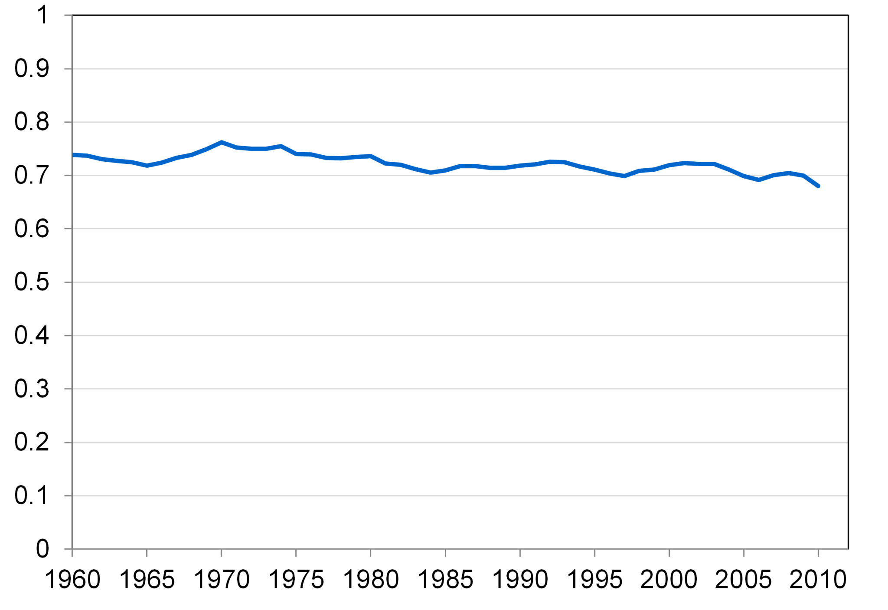

### National Income: Where it Come from and Where it Goes

**Factors of production** is the in put for producing services and product:

- $K$ = capital
- $L$ = labor

How much output($Y$) the economy can produce from $K$ and $L$ can be described as **the production function**:
$$
Y=F(K,L)
$$
If the production function is ==constant returns to scale==,
$$
zY=F(zK,zL)
$$
In this chapter, we assume that the factor of production is fixed:
$$
K=\overline{K}\\
L=\overline{L}
$$
hence , output is also fixed:
$$
\overline{Y}=F(\overline{K}, \overline{L})=Y
$$
Company sold their product at price $P$, hired employee at wage $W$ and rent capital at rental rate $R$, so its profit is:
$$
Prodit = PF(K,L)-WL-RK
$$
The **Marginal Product of Capital**(MPK) is:
$$
\frac{\partial\ F(K,L)}{\partial K}=MPK
$$

For maximize profit
$$
\frac{\partial\ \text{profit}}{\partial K}=P\times MPK-R=0
$$
Hence
$$
MPK=\frac{R}{P}
$$
which is **real wage**

Similarly
$$
MPL=\frac{W}{P}
$$
which is **real rental rate**

If production function has constant returns to scale, then seeking partial guidance for $z$
$$
zY=F(zK,zL)\\
Y=Lf^{(0,1)}(K z,L z)+Kf^{(1,0)}(K z,L z)
$$
Let $z=1$,
$$
Y=L\times MPL+K\times MPK
$$
Above result is **Euler’s theorem**

> **The ratio of labor income to total income in the U.S.**
>
> 

Labor’s share of income is approximately constant over time,  **the Cobb-Douglas production function** has such property can described this phenomenon.
$$
MPL\times L=(1-\alpha)Y\\
MPK\times K=\alpha Y
$$

> Cobb-Douglas production function
> $$
> F(K,L)=AK^{\alpha}L^{1-\alpha}
> $$

**Gini coefficient** is a measure to represent the gap between rich and poor

The graph shows that the Gini coefficient is equal to the area marked *A* divided by the sum of the areas marked *A* and *B*, that is,
$$
\text{Gini}=\frac{A}{A+B}
$$

Components of aggregate demand:
$$
Y=C+I+G
$$
**Disposable income** is total income minus total taxes:
$$
(Y-T)
$$
Consumption function is $C=C(Y-T)$

**Marginal propensity to consume (MPC) **is the change in ***C*** when disposable income increases by one dollar.

The **investment function** is $I=I(r)$, where $r​$ denotes the **real interest rate**

$G$ is the government spending on g$s, excludes transfer
payments. Assume government spending and total taxes are exogenous: 
$$
\mathbf{G}=\overline{\boldsymbol{G}} \quad \text { and } \quad \boldsymbol{T}=\overline{\boldsymbol{T}}
$$
We obtain following equilibrium:
$$
\overline{Y}=C(\overline{Y}-\overline{T})+I(r)+\overline{G}
$$
The real interest rate adjusts  to equate demand with supply.

Rewrite the above equilibrium as:
$$
Y-C-G=I
$$
The left hand denotes the residual output after satisfy consumer and government, which is called **national saving(S)**. It’s also equal to the sum of private saving and public saving:
$$
\begin{aligned} \mathrm{S} &=\text { private saving }+\text { public saving } \\ &=(\mathbf{Y}-\boldsymbol{T})-\boldsymbol{C}+\boldsymbol{T}-\mathbf{G} \\ &=\mathbf{Y}-\boldsymbol{C}-\mathbf{G} \end{aligned}
$$

S depends on $Y, T$ and $G$, for fixed $Y, T$ and $G$, S is also fixed.

