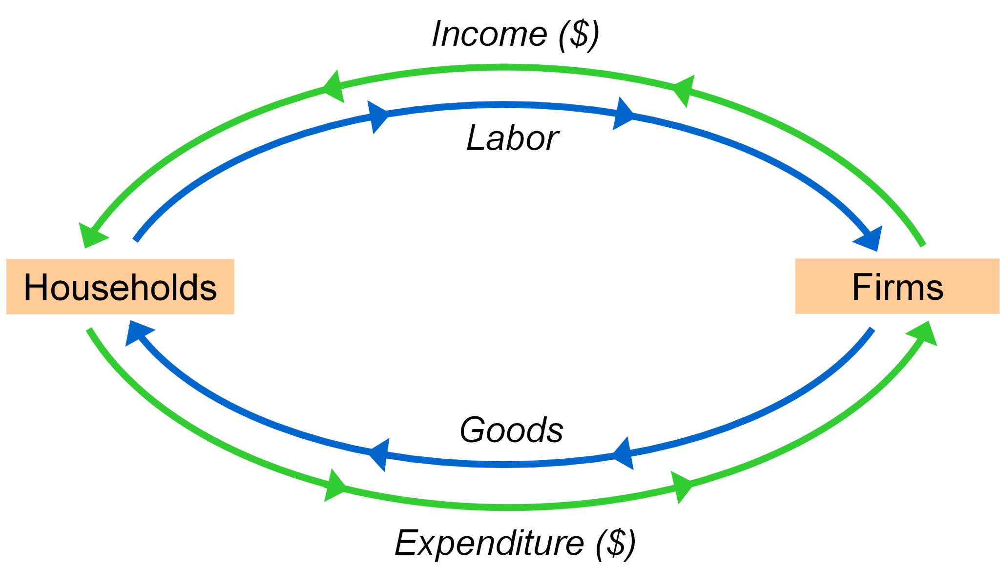

### The data of Macroeconomics

#### Gross Domestic Product: Expenditure and Income

==GDP== has two definitions:

- Total expenditure on domestically produced 
  final goods and services
- Total income earned by domestically located 
  factors of production. 

==Value added== is the value of output minus the value of the intermediate goods used to produce that output 
$$
\begin{aligned} \mathrm{GDP} &=\text { value of final goods produced } \\ 
&=\text { sum of value added}   
\end{aligned}
$$
Since **value of total output** is equal to **aggregate expenditure**, GDP can be calculated by 
$$
Y=C+I+G+NX
$$
where $Y$ is the **value of total output**, $C$ is **consumption**, I is **investment**, $G$ is **government spending** and $NX$ is **net exports**.

==Consumption== is the value of all goods and services(To short, we use “g&s” to stand for “goods & services”)
bought by households. Includes:

- ***Durable goods*** 
- **Nondurable goods**
- **Services**

==Investment== is the spending on capital, a physical asset used in future production. Includes:

- **Business fixed investment**
- **Residential fixed investment**
- **Inventory investment**

Government spending ==excludes== **transfer payments** 

Net exports holds the following equation:
$$
\mathbf{N X}=\text { exports }-\text{imports}
$$
where ==exports== is the value of g&s sold to other countries, ==imports== is the value of g&s purchased from other countries

reexamine the concept of GDP, we have following:

- Total income
- Total outout
- Total expenditure
- The sum of value added at all stages in the production of final goods

Gross **national** product (GNP) is total income earned by the nation’s factors of production(while GDP is domestically-located) , regardless of where located(while GDP is nationality).

In the other word:
$$
{\mathrm{GNP}-\mathrm{GDP}=
\text { factor payments from abroad }}- {\text { factor payments to abroad }}
$$

GDP can be sorted as **Nominal GDP** and **Real GDP**:

==Nominal GDP== measures these values using current prices. 

==Real GDP== measures these values using the prices of a base year. 

The difference between nominal and real is resulted from the increase in prices, we use ==GDP deflator== to describe ==inflation rate==
$$
GDP\ \text{deflator}=100 \times \frac{\text { Nominal GDP }}{\text { Real GDP }}
$$
Recall
$$
d(x y)=d x \frac{\partial(x y)}{\partial x}+d y \frac{\partial(x y)}{\partial y}
$$
Hence 
$$
\frac{d(xy)}{xy}=\frac{dx}{x}+\frac{dy}{y}
$$
therefore percentage change in NGDP approximate to the sum of percentage in GDP  deflator and RGDP.

==chain-weighted real GDP== updates the base year, which is more accurate than constant-price GDP 

**Consumer price index (CPI)** is a more popular measure
of the overall level of prices. CPI in any month equals
$$
100 \times \frac{\text { Cost of basket in that month }}{\text { cost of basket in base period }}
$$
The CPI may overstate inflation because

- **Substitution bias**
- **Introduction of new goods**
- **Unmeasured changes in quality**

