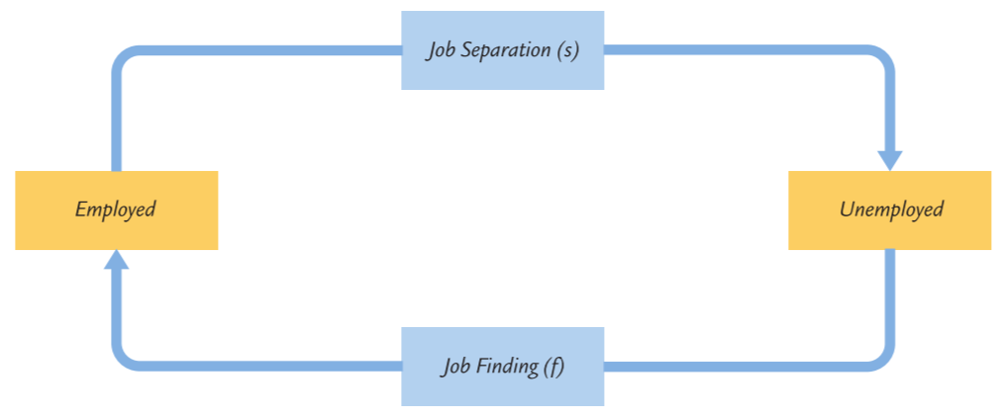

### Unemployment and the Labor Market

 Let $L$ denote the labor force, $E$ the number of employed workers, and $U​$ the number of unemployed workers.

In this notation, the rate of unemployment is $\frac{U}{L}$.

if the unemployment rate is fixed, the equation below fixed:
$$
fU=sE
$$
which is the **steady-state condition**.

Substitute $L-U$ for $E$:
$$
f \frac{U}{L}=s\left(1-\frac{U}{L}\right)
$$
So we obtain
$$
\frac{U}{L}=\frac{1}{1+f / s}
$$

